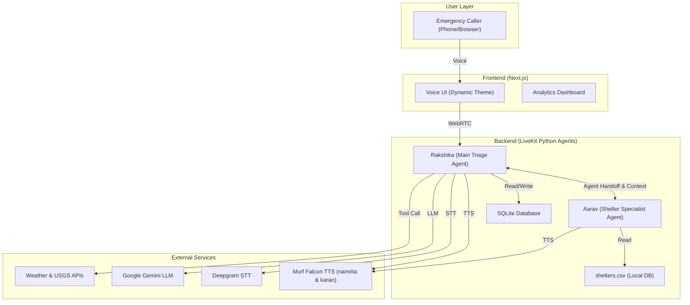

# Product Requirements Document (PRD)
# Rakshika AI — Multi-Agent Voice AI Emergency Response System

---

## 1. Overview

**Product Name:** Rakshika AI Ecosystem  
**Tagline:** India's First Multi-Agent Voice Assistant for Disaster Emergency Response  
**Version:** 2.0 (Day 10 Milestone)  
**Author:** Prathamesh Khairnar  
**Date:** August 15, 2026  

Rakshika AI is a production-grade, Hindi-speaking Voice AI agent ecosystem designed to assist the National Disaster Response Force (NDRF) in handling emergency calls during natural disasters. It combines real-time voice interaction, multi-agent handoffs, and live analytics to create a complete command center for disaster management.

---

## 2. Problem Statement

During natural disasters (floods, earthquakes, cyclones), emergency helplines get overwhelmed with thousands of simultaneous calls. Human operators cannot handle the volume, leading to:
- Missed distress calls and delayed responses
- Inconsistent information delivery to callers
- Monolithic systems unable to handle highly specialized, hyper-local requests efficiently.
- Zero real-time visibility into call volume and incident trends

**Rakshika AI solves this by acting as a 24/7, always-available, Multi-Agent Hindi-speaking emergency voice system**. It dynamically routes callers to specialized agents (e.g., Shelter Experts) while logging every interaction for real-time monitoring.

---

## 3. Target Users

| User Type | Description |
|-----------|-------------|
| **Emergency Callers** | Citizens in distress during natural disasters who call for help |
| **NDRF Command Center** | Operators monitoring live call data and incident distribution |
| **Field Rescue Teams** | Teams receiving escalation alerts with caller location details |

---

## 4. Tech Stack

| Layer | Technology | Purpose |
|-------|-----------|---------|
| **Voice AI Framework** | LiveKit Agents SDK v1.4 | Real-time voice pipeline orchestration |
| **Text-to-Speech** | Murf Falcon TTS | Ultra-realistic Hindi voice synthesis (Male & Female profiles) |
| **Speech-to-Text** | Deepgram Nova-3 | Real-time Hindi speech recognition |
| **LLM** | Google Gemini 1.5 Flash | Conversational intelligence, routing & decision making |
| **VAD** | Silero VAD + LiveKit Turn Detector | Voice activity & turn detection |
| **Frontend** | Next.js + React + TypeScript | Web UI, Dynamic Theming & Analytics Dashboard |
| **Database** | SQLite (DB) + Local CSV | Caller data persistence & Shelter data lookup |

---

## 5. Core Features & Agents

### 5.1 Multi-Agent Ecosystem (Backend)

| Agent / Feature | Description | Status |
|---------|-------------|--------|
| **Rakshika (Main Agent)** | Female voice (`hi-IN-namrita`), primary triage agent. | ✅ Done |
| **Aarav (Shelter Specialist)** | Male voice (`hi-IN-karan`), takes over for shelter queries. | ✅ Done |
| **Two-Way Handoffs** | Rakshika transfers to Aarav; Aarav can transfer back to Rakshika. | ✅ Done |
| **Context Preservation** | Memory and conversation context (`chat_ctx`) passed between agents. | ✅ Done |
| **Local Data Querying** | Aarav queries a local `shelters.csv` to find real-time relief camp capacity. | ✅ Done |
| **Live Weather Lookup** | Rakshika fetches real-time weather data via Open-Meteo API. | ✅ Done |
| **Earthquake & Hospitals** | Rakshika queries USGS (Earthquakes) and Google Maps (Hospitals). | ✅ Done |
| **Rescue Escalation** | Generates Reference IDs (REQ-1234) and alerts the frontend UI for trapped users. | ✅ Done |

### 5.2 Voice UI (Frontend)

| Feature | Description | Status |
|---------|-------------|--------|
| **Dynamic Agent Theming** | UI shifts from Red (Rakshika) to Green (Aarav) during handoff. | ✅ Done |
| **Real-Time Handoff Alerts** | LiveKit Data Channels trigger "Agent Transferring" visual states. | ✅ Done |
| **Escalation Alert Card** | Red overlay appears on UI when human rescue is requested. | ✅ Done |
| **Audio Visualizer** | Real-time audio waveform during conversation. | ✅ Done |

### 5.3 Analytics Dashboard (Frontend)

| Feature | Description | Status |
|---------|-------------|--------|
| **Live Dashboard** | Real-time metrics page at `/dashboard` | ✅ Done |
| **Session Analytics Chart** | Line chart showing daily call volume & resolution trend | ✅ Done |
| **Incident Distribution** | Breakdown by category (Weather, Hospital, Rescue, Shelter) | ✅ Done |
| **Auto-Refresh** | Dashboard polls API every 10 seconds for live updates | ✅ Done |

---

## 6. System Architecture (Multi-Agent)

---

## 7. Development Timeline

| Day | Milestone | Status |
|-----|-----------|--------|
| Day 1 | Project setup, LiveKit + Murf Falcon integration | ✅ |
| Day 2 | System prompt engineering, Hindi voice agent | ✅ |
| Day 3 | Tool integration (Weather, Hospital, Rescue) | ✅ |
| Day 4 | Caller registration & SQLite database | ✅ |
| Day 5 | Outbound calling & SIP telephony | ✅ |
| Day 6 | Frontend UI polish, 3D welcome scene | ✅ |
| Day 7 | Dashboard UI skeleton, branding | ✅ |
| Day 8 | Live analytics integration, real-time dashboard | ✅ |
| **Day 9** | **Multi-Agent Architecture, Specialist Agent (Aarav), Two-way Handoffs** | ✅ |
| **Day 10** | **Final System Integration, Documentation, and Project Publication** | ✅ |

---

## 8. References
- [Murf Falcon TTS Docs](https://murf.ai/api/docs/text-to-speech/streaming)
- [LiveKit Agents Handoff](https://docs.livekit.io/agents/logic/agents-handoffs/)
- [GitHub Repository](https://github.com/Prathameshkhairnarr/Murf-Ai)
